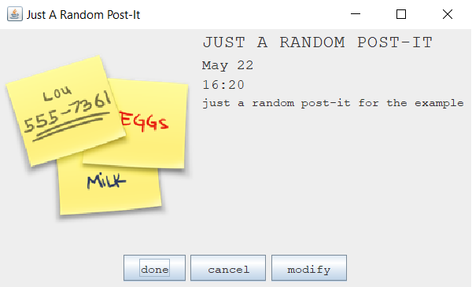
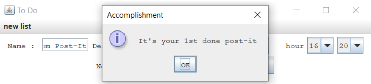
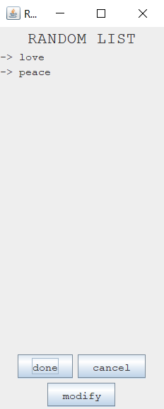

# TO DO APP


### Description
Created a to-do app with post-it and lists. I would love to hear new ideas to improve the project.

### Use Project
(you'll need to have Java in your PATH if you don't have it go check this [link](https://javatutorial.net/set-java-home-windows-10))

Now to launch it firstly compile the code by executing this command line in the folder where ALL the files of the app are stored.
```
javac *.java
```
Finally, launch it by executing the command below.
```
java ToDoApp
```
### View Project
Unfortunately for now I can't host the code so to compensate here are some screenshots.

<p align="center">

</p>
<br/>
<p align="center">

</p>
<br/>   
<p align="center">

</p>
<br/>
<p align="center">

</p>
<br/>         

### About the Project
The project now is sort of up in the air but if you have ideas, or you want to be involved please contact me on my mail at poire.erwan2005@gmail.com or anywhere else.
