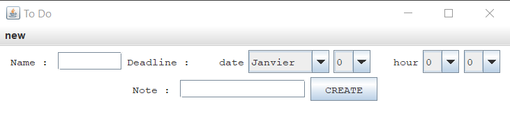
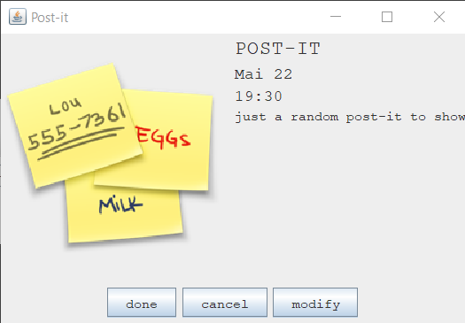
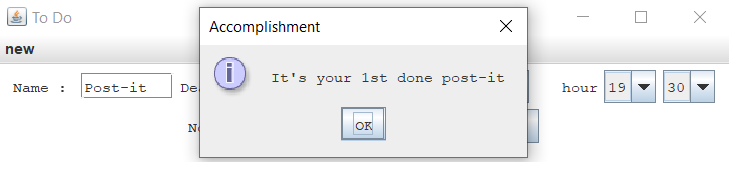
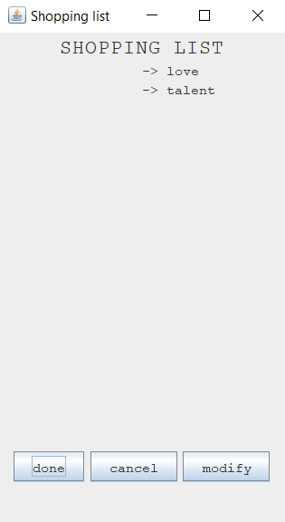

# TO DO APP


### Description
Created a to-do app with post-it(with a deadline) and list. The project is in progress, so I would love to hear new ideas.

### Use Project
(you'll need to have Java in your PATH if you don't have it go check this [link](https://javatutorial.net/set-java-home-windows-10))

Now to launch it firstly compile the code by executing this command line in the folder where ALL the files of the app are stored.
```
javac *.java
```
Finally, launch it by executing the command below.
```
java ToDoApp
```
### View Project
Unfortunately for now I can't host the code so to compensate here are some screenshots.

<p align="center">

</p>
<br/>
<p align="center">

</p>
<br/>   
<p align="center">

</p>
<br/> 
<p align="center">

</p>
<br/>                                                                                        
### About the Project
The project is constantly evolving and a lot of new things are upcoming so if you have ideas, or you want to be involved please contact me [here](poire.erwan2005@gmail.com) or anywhere else.
